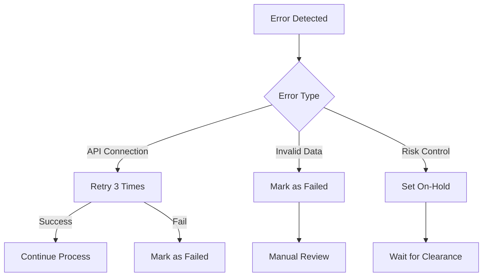
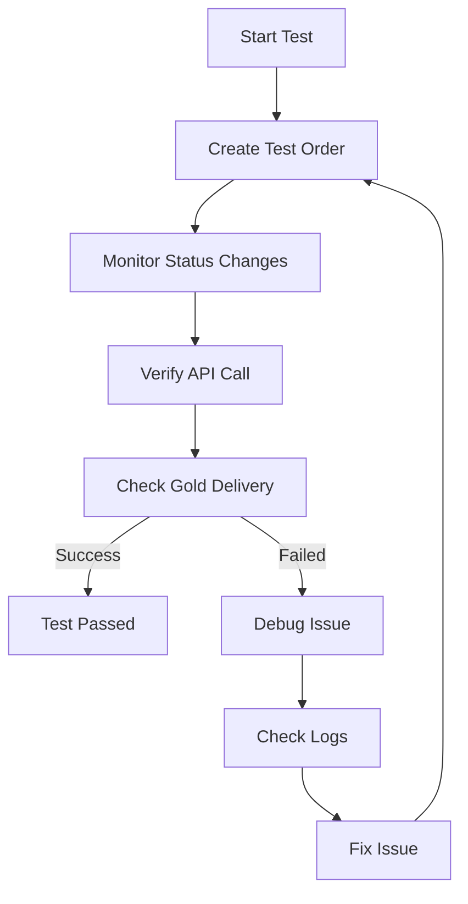

# Milestone 4: StarCoin Savings Fraud Prevention Plugin

## Overview
The StarCoin Savings Fraud Prevention plugin is a WooCommerce extension designed to prevent fraud and manage order processing for StarCoin Savings. This milestone focuses on implementing advanced fraud prevention features and order processing workflows.

## Key Features

### 1. Fraud Prevention System
- Automated fraud detection and prevention
- Custom order statuses for fraud management
- Real-time order status updates
- Detailed order logging and tracking

### 2. StarMaker API Integration
- Secure API communication with StarMaker
- Real-time order processing
- Gold delivery verification
- Error handling and retry mechanisms

### 3. Order Processing Workflow
- Automated order status management
- Custom status transitions
- Fraud check validation
- Risk control integration

## Technical Implementation

### Custom Order Statuses
The plugin implements the following custom order statuses:
- `review-required`: Orders requiring manual review
- `blocked`: Orders that failed fraud checks
- `passed-fraud-check`: Orders that passed initial fraud checks

### API Integration
- Base URL: `https://pay-test.starmakerstudios.com/api/v3/external/agent/create-order`
- Method: POST
- Content-Type: application/json

### Request Parameters
```json
{
    "sid": "StarMaker ID",
    "currency": "Order Currency",
    "price": "Order Total",
    "gold": "Gold Amount",
    "oid": "Order ID",
    "client_ip": "Customer IP",
    "source": "web_store"
}
```

### Response Codes
- `0`: Success
- `1`: Payment declined
- `151`: Risk control (order pending)
- `4010005`: Invalid IP address

## Process Flow

### Order Processing
1. Order Creation
   - Customer places order with StarMaker ID
   - System stores gold amount in order meta
   - Initial fraud check performed

2. Fraud Check Process
   - System checks order details
   - If passes → Status changes to "processing"
   - If fails → Status changes to "blocked"
   - If needs review → Status changes to "review-required"

3. StarMaker API Integration
   - When order status changes to "processing"
   - System calls StarMaker API
   - API response determines final order status

### Error Handling


## Testing Procedures

### Test Flow


### Success Criteria
- Order status reaches "Completed"
- Gold delivered to StarMaker ID
- All meta data properly stored
- No errors in logs

## Configuration

### General Settings
1. API Credentials
   - App Key: `hashtag-7i36xt0t`
   - App Secret: `8a0c3250725d09be379ce8ed901c5cd7`
   - Agent UID: `12666376951992244`

2. Order Processing
   - Enable/Disable automatic order processing
   - Set fraud check thresholds
   - Configure order status mappings

## Troubleshooting

### Common Issues
1. INVALID_IP Error (4010005)
   - Cause: Running on localhost or invalid IP
   - Solution: Ensure server has valid public IP

2. Order Not Processing
   - Check order status
   - Verify fraud check passed
   - Check API credentials

3. API Connection Issues
   - Verify API credentials
   - Check server connectivity
   - Ensure SSL certificate is valid

### Debug Logging
Enable debug logging in WordPress:
1. Add to wp-config.php:
```php
define('WP_DEBUG', true);
define('WP_DEBUG_LOG', true);
```

2. Check debug.log in wp-content directory

## Limitations
1. Fraud Risk Score
   - StarMaker API does not provide fraud risk scores
   - Plugin uses custom fraud prevention system

2. Auto-Refund
   - StarMaker API does not support automatic refunds
   - Refunds must be processed manually

3. IP Requirements
   - API requires valid public IP address
   - Localhost testing may require special configuration

## Support
For support or questions:
- Email: [Your Support Email]
- Documentation: [Your Documentation URL]
- GitHub Issues: [Your GitHub Repository]

## License
This plugin is licensed under the GPL v2 or later. 