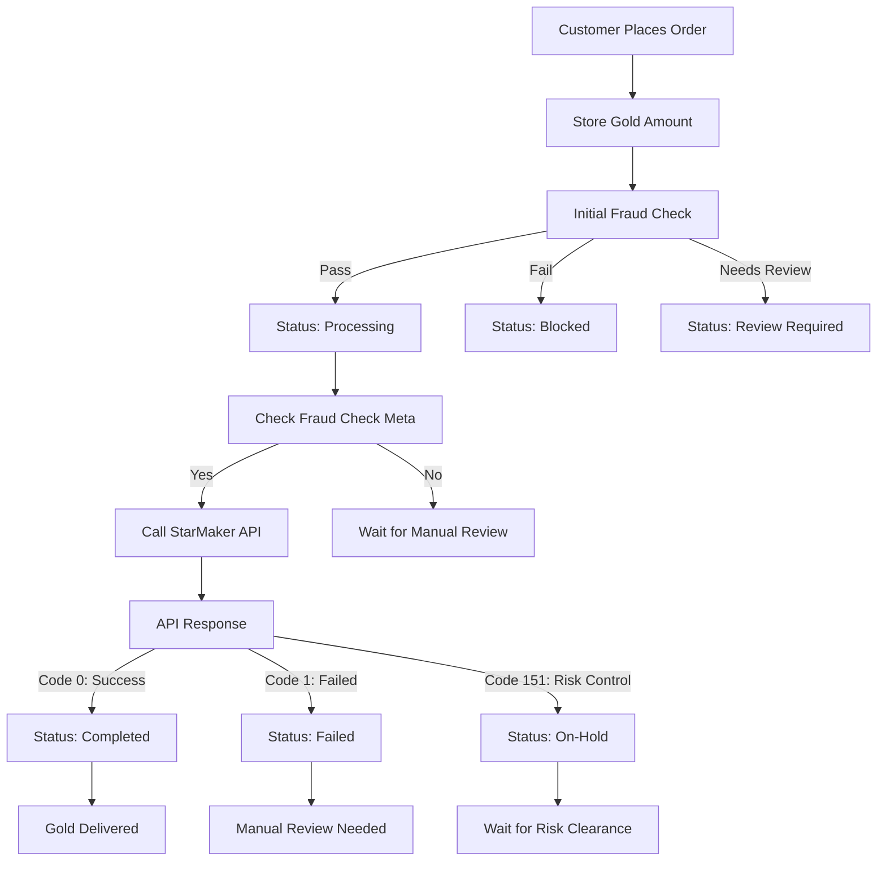
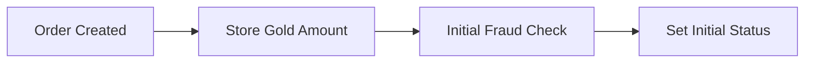
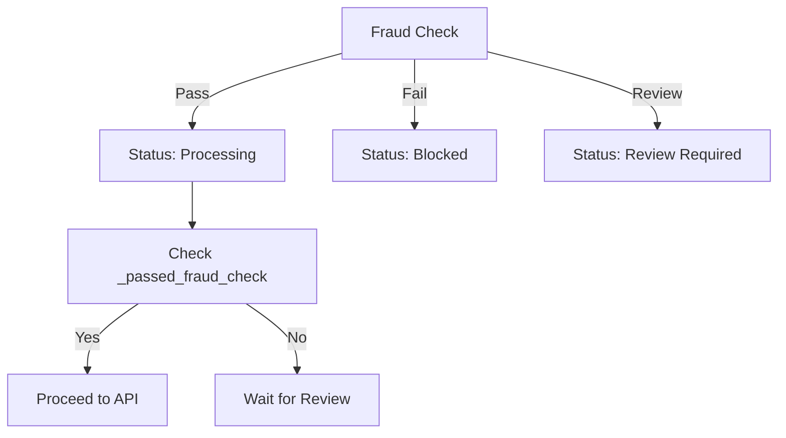
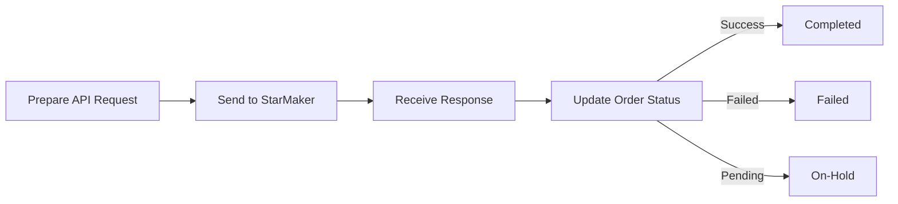
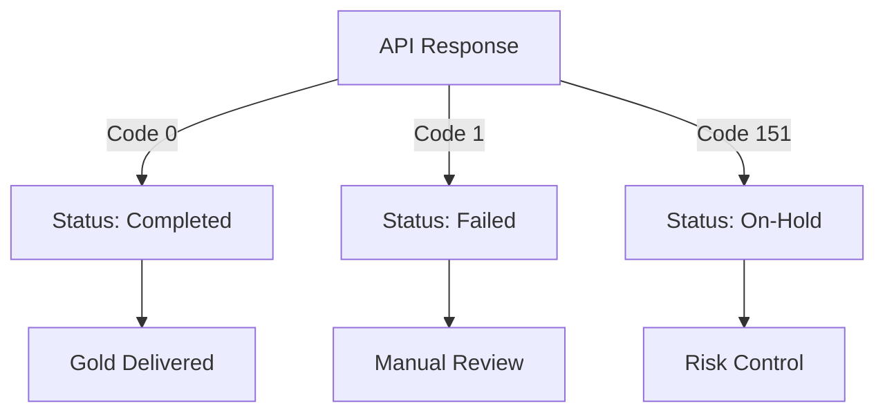
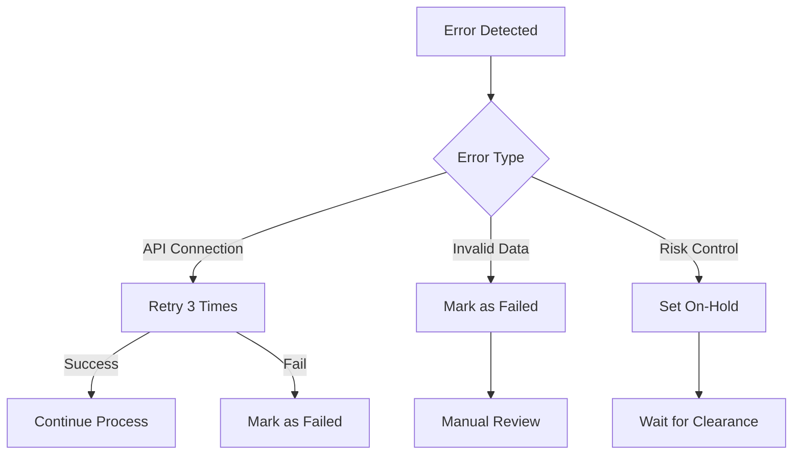
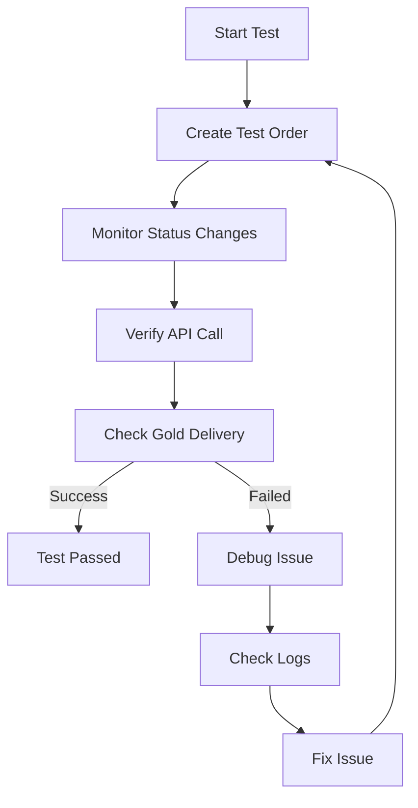

# StarCoin Savings Order Processing Flow

## Complete Order Processing Flowchart



## Detailed Process Steps

### 1. Order Creation & Initial Processing


### 2. Fraud Check Process


### 3. StarMaker API Integration


### 4. Status Update Flow


## Key Status Transitions

1. **Successful Flow**
```
Pending → Processing → Completed
```

2. **Failed Flow**
```
Pending → Blocked
```

3. **Review Flow**
```
Pending → Review Required → Processing → Completed
```

4. **Risk Control Flow**
```
Pending → Processing → On-Hold → Completed
```

## Error Handling Flow



## Testing Flow



## Important Notes

1. **Status Definitions**
   - `Pending`: Initial order state
   - `Processing`: Passed fraud check, being processed
   - `Completed`: Successfully delivered
   - `Failed`: Order failed
   - `Blocked`: Failed fraud check
   - `Review Required`: Needs manual review
   - `On-Hold`: Risk control pending

2. **Key Checkpoints**
   - Gold amount stored in order meta
   - Fraud check passed flag
   - API response validation
   - Status update confirmation

3. **Error Points**
   - Invalid StarMaker ID
   - API connection issues
   - Risk control blocks
   - Invalid IP address

4. **Success Criteria**
   - Order status reaches "Completed"
   - Gold delivered to StarMaker ID
   - All meta data properly stored
   - No errors in logs 